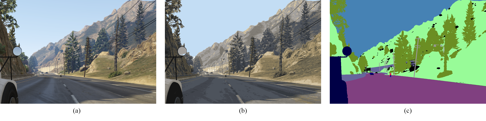

This work focuses on applying Unsupervised Domain Adaptation for Semantic Segmentation Task (UDA-SST) on Autonomous Driving. We proposed some different ways to address this problem, including Consistency Learning, Edge Detection, Color Quanntization, Gray-World Algorithm, and each of them can achieve state-of-the-art performance.

