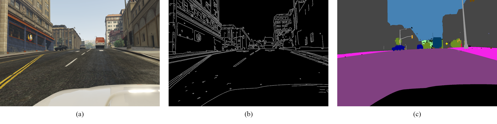

Our framework mainly consists of two modules: the segmentation model and the RL agent. The segmentation model produces the semantic segmentation map of the raw input image, and the RL agent will make decisions based on the segmentation map. In the following, we first elaborate on how we trained our segmentation model and RL agent. Then, we show how we deploy our models and perform the autonomous driving task in the real world.

## Techniques of UDA-SST
We trained our segmentation via unsupervised domain adaptation. To further improve the performance of the previous work and make UDA practical to the real application, we propose four powerful techniques that are easy to implement and compatible with the existing work.

#### Consistency learning

Motivated by the success of self-supervised and semi-supervised learning, we adopt the consistency learning framework to improve training stability. Our method resembles Mean Teacher architecture where we have one teacher network and one student network with identical structures. The parameter of the teacher network is the moving average of the student network. The difference between our method and Mean Teacher is that we apply strong augmentation to the input image of the student network and weak augmentation to the input image of the teacher network.

$X \rightarrow X_{s} \rightarrow f_{s} \rightarrow P_{s}$

$\ \ \ \ \ \searrow X_{w} \rightarrow f_{t} \nrightarrow P_{t}$

As described in above equation, the image $X$ is augmented as strong augmentation image $X_s$ and weak augmentation image $X_w$ and pass to student network $f_s$ and teacher network $f_t$ respectively. The consistency loss is the standard pixel-wise cross-entropy supervised by the probability map of teacher network $P_t$. The symbol $\nrightarrow$ denotes stop gradient as the parameter of teacher network is updated via moving average of the parameter of student network.

Intuitively, the teacher network with weak augmentation input can provide relatively stable and reliable predictions whereas the student network is enforced to predict consistently with the teacher network under different augmentations. Hence, the student network can learn more general knowledge and be robust to the perturbations. This approach is easy to implement and can be combined with the existing architecture. We can just add $\lambda L_{c}$ directly to the original training objective where $L_{c}$ is the consistency loss and $\lambda$ is the trade-off parameter.

#### Edge Prediction

The combination of depth estimation and semantic segmentation is effective. However, this method needs extra data or training self-supervised depth estimation model, which inspires us to come up with another representation that is domain invariant and easily accessible. Then we found out that the outer edge of objects can fulfill the goal, since the estimation can be simply obtained by traditional computer vision method which does not require model training.

Moreover, we observed that the segmentation prediction error often happens at the edge of objects, that the branch of predicting edges can guide the model to pay more attention to the parts which are prone to error.

#### Color Quantization

Color quantization is a traditional computer graphic method to decrease the number of colors in an image. We utilize this ability to remove redundant information (such as unintended noise, detailed illumination and shadow, texture details, etc.) from the original image. This idea is motivated by the nature of the semantic segmentation map: blocks of color in the segmentation maps are more coarse-grained than the original input image. We then expect that if we remove the over-detailed information from the raw image, the possibility of model overfitting could decrease, and the quality of the generated segmentation map will improve.

For example, the above figure shows the image before/after the color quantization and the corresponding segmentation map. We can see that the structure of color in the color-quantized image is closer to the segmentation map, and that the objects in the quantized image have a sharper edge.

For the implementation details, we use k-means to find $k$ color clusters in the image, then map each pixel to the nearest color. However, since the dimension of the raw image could be too large to calculate k-means, we instead use 2000 pixels randomly sampled from the raw image to find clusters.

#### Gray-World Algorithm

There is a big difference between source and target domain: hue. For example, images in the GTA5 dataset tend to be more yellowish, while images in Cityscapes are more greenish. To address this problem, we adopt the gray-world algorithm, which utilizes the assumption that the color in each RGB channel averages to gray over the entire image, to remove the undesired hue shift from the original image. This can reduce the domain gap between source and target domain.

## RL agent
Reinforcement learning (RL) algorithms have been applied in a range of robotic control. The agent will learn how to make decisions to maximize the reward given by the environment and finally learn a strategy to avoid obstacles.

#### RL algorithms in Unity ML-Agent Toolkits
Our goal is to help the agent learn general meaning about road and other objects in the simulated environment so as to act correctly in reality. We adopt policy learning in continuous action spaces and use Unity ML-Agents soft actor-critic (SAC) algorithm and Proximal Policy Optimization (PPO) algorithm to train our Reinforcement Learning model. Considering an infinite-horizon Markov decision process (MDP), we define the tuple ($S$, $A$, $p$, $r$) representing the continuous state space, action space, the unknown state transition probability and the bounded reward on each transition, respectively. We also define policy $\pi$ as a distribution over actions given states, which will fully explain the behavior of an agent.

Here, we briefly explain the difference between the two algorithms we mentioned above. SAC is an off-policy algorithm. Its behavior policy, which we used to evaluate, is different from the estimation policy. It maximizes the expected sum of rewards while also maximizing entropy, making the agent try to succeed at each episode while choosing the action as randomly as possible. Compared with SAC, PPO is an on-policy algorithm: the evaluated and improved policy is also used to select actions. Its central idea is to avoid having too large policy updates, using hyperparameter $\beta$ to limit the KL divergence between our new policy $\pi_{\theta}$ and old policy $\pi_{\theta_{old}}$ and uses $\epsilon$ to adjust the clip, which constraints the policy will only change in a small range in every step.

#### Simulation Environment}

We use Urban Traffic System asset to design a RL environment in Unity, and this virtual scene was built based on the landscape of National Tsing-Hua University. Unity engine can generate the corresponding segmentation images based on constructed virtual scene and as the input observations of the agent. With this simulated environment, our agent can fetch infinite training sources,  at the same time, alleviating the cost of collecting data in the reality. To simplify the training environment, we assort the objects into nine classifications: sky, road, building, bike, car, terrain, vegetation, sidewalk, and person. For example, the image above shows the different raw image shots in our environment and their corresponding ground-truth segmentation images.

### Husky & ROS pipeline

We next discuss how we deploy our UDA-SST model and RL agent to NVIDIA Xavier and Clearpath HUSKY A200. We equip it with a Zed2 camera, which can support 720p 60 FPS streaming video. HUSKY is controlled by Robot Operating System (ROS). We wrap each module into a ROS Node, listening from the previous module, and publishing processed data to the next module. Zed Camera Controller will publish RGB images to UDA-SST module. UDA-SST module will generate semantic segmentation and stack it with the previous semantic segmentation frame. RL Agent will then use the stacked semantic segmentation masks to make decisions and send signals to the HUSKY controller. In our experiment, inferencing an image using ResNet-101 based model on NVIDIA Xavier has up to 1.0s latency, which is not very ideal for autonomous vehicles. As the result, we choose to distill our UDA-SST models to a single MobileNet based model. MobileNet can result in lower latency (0.09s) and a higher frame rate.

<!--  -->


  
