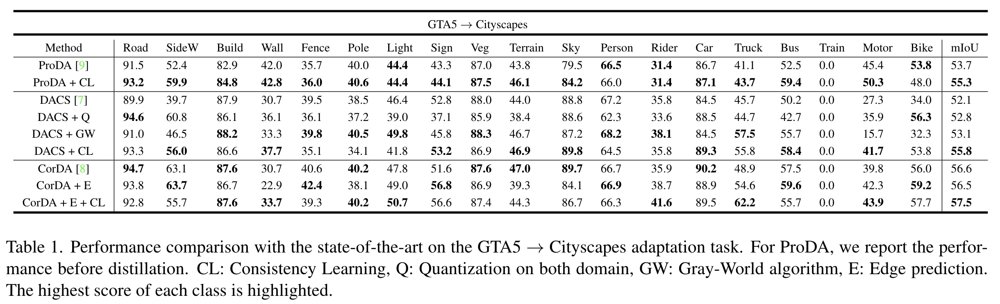
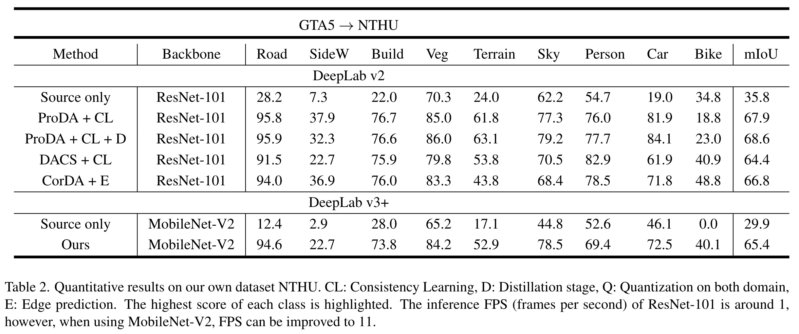

## UDA-SST
We conduct several experiments on two synthetic-to-real adaptation tasks to demonstrate the effectiveness of our UDA techniques. The two synthetic-to-real adaptation tasks are GTA5 $\to$ Cityscapes and GTA5 $\to$ NTHU. To be specific, we validate our method by comparing with the previous work in the first task GTA5 $\to$ Cityscapes. In the second task, we present the adaptation result on our dataset NTHU.

#### GTA5 $\to$ Cityscapes

GTA5 $\to$ Cityscapes is the standard benchmark for UDA-SST. We compare our method with the previous works. First, we can observe that all the experiments with consistency learning outperforms the baseline version by a large margin. Thus, we can prove that our consistency learning framework can indeed help the model learn a better knowledge of the target domain. By integrating the existing UDA methods with our consistency learning framework, we can expect a considerable improvement. Next, we show that applying quantization or gray-world to the image can result in a performance boost. This is quite amazing since these are just simple calibrations on the input image. Thus, we can add these techniques to every UDA method without changing the training framework and the network design. Lastly, by exploiting the information in edge prediction, we have a competitive result with the previous version that utilizes depth information. However, our method is less complicated because we do not need additional data to train the depth estimator.

#### GTA5 $\to$ NTHU

NTHU is a dataset collected by ourselves that contains 2650 images on the campus of the National Tsing Hua University. Specifically, We drove HUSKY A200 around the campus and collected images using the Zed camera on it. As described in \cref{sssec:env}, we define nine classes for semantic segmentation. We labeled 40 images as the testing set and reported the testing result in \cref{tab:nthu_benchmark}.

The result shows that we can achieve rather high mIoU score without any labeled data of the target domain dataset, proving that UDA-SST is indeed a practical method that can apply to real applications. Moreover, our UDA-SST model contributes to a remarkable performance improvement compared with the model that trained with only source dataset without adaptation. Overall, we can confirm that UDA-SST is an effective method to close the domain gap and result in better adaptation. Surprisingly, we can further distill the knowledge into a lighter model for the sake of implementing the model in real-time. In our work, we distill the knowledge of our well-trained model using Resnet-101 as backbone to a light-weight model with backbone MobileNetv2, which demonstrates tremendous speedup (about 10 times faster) with acceptable performance.

## RL training

| Action                                 | Reward |
| -------------------------------------- | ------ |
| if moving out off the track            | -5     |
| if hitting obstacles                   | -5     |
| if reaching the goal                   | +5     |
| if turning right or left and surviving | +0.01  |
| if going straight and surviving        | +0.015 |

Table above shows the average reward return of evaluation during training for PPO and SAC. We train each algorithm with three different random seeds and perform one evaluation rollout every 10000 environment steps. In the reward setting part, when the agent arrivals the goal successfully, it will receive a high reward of +5. To teach the agent to learn obstacle-avoiding and only run on the road, we give a penalty of -5 once it collides with objects or runs out off the track. In addition, to encourage the agent to survive, we give it a +0.01 survival reward. We also hope our agent can act like a person, which means it will not move so randomly but go straight while there is nothing that should be avoided, so we set an extra reward of +0.005 to encourage it to choose a go straight action. In summary, the reward at time step $t$ is defined as following:

## Husky
We integrate the segmentation and RL agent, deploying them to NVIDIA Xavier and Clearpath HUSKY A200 while also testing its ability in the real world. We use MobileNet as our segmentation model and PPO algorithm for our RL agent. Setting the inference FPS as 5 means the RL agent will make 5 decisions in one second. In other words, every action selected by the RL agent will repeat for roughly 0.2 seconds. After setting up the pipeline, we ask HUSKY to perform obstacle avoidance on the campus of National Tsing-Hua University. To be specific, HUSKY will try to avoid pedestrians, bikes, and cars while driving along the road. In our real-world experiments, we observe that HUSKY can take correct actions to avoid obstacles.